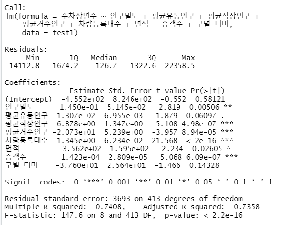

## 장소분석 : 자치구별 또는 광진구 법정동별 주차 관련 현황 분석
- 자치구별, 광진구 법정동별 차량등록대수 현황 (2022년)
    - 광진구는 25개 중 17번째로 자동차 등록대수가 많음
- 자치구별, 광진구 법정동별 주차면수 현황 (2022년)
    - 광진구는 25개 중 18번째로 주차면수가 많음
- 자치구별, 광진구 법정동별 주차장확보율 현황 (2022년)
    - 주차장 확보율 = 주차면수/차량등록대수 *100 
    - 광진구는 25개 중 14번째로 주차장확보율이 높음
- 지점별 교통량을 기반으로 한 구별 교통량 현황 (2023년 2월)
    - 교통량 측정 지점별 위치에 따라 구별 교통량의 평균을 내어 산출
    - 광진구는 25개 자치구 중 4번째로 교통량이 많으나 교통량 대비 주차면수는 21번째로 많다
- 광진구 법정동별 주정차위반단속현황 (2022년)
    - 구의동, 중곡동, 자양동 순으로 주정차위반 단속건수가 높음

## 분산분석 
- 주제 : 서울특별시의 25개 자치구별로 주차장 면수에 대한 차이가 있는지 여부
- 독립변수 : 구별, 종속변수 : 주차장면수 (2022년 기준)
- 분석 : R 활용
  - aov와 shapiro.test를 활용하여 결과 정규성을 따른다는 귀무가설 기각
  - kruskal.test를 활용한 분산 분석 결과 p<0.05로 구별 주차면수가 동일하다는 귀무가설을 기각

## 상관 분석 
- 주제 : 변수간의 상관관계 파악
- 분석 : R 활용
  -인구밀도와 평균거주인구간의 상관관계가 0.94로 높게 나타남

## 다중회귀분석 
- 주제 : 서울특별시의 행정동별로 주차면수에 영향을 주는 요인은 무엇인지 
- 독립변수 : 인구밀도, 평균교통량, 평균유동인구, 평균직장인구, 평균거주인구, 차량등록대수 주민인구, 면적, 승객수, 구별더미변수, 종속변수 : 주차장 면수 (2022년 기준)
- 분석 : R 활용 
  - 결측치 
    - 삭제 : 11개의 변수에 대해 모든 값을 가지 않은 일원2동, 개포3동, 항동, 상일동 등 삭제
    - 대체 : 평균교통량의 경우 지점별로 교통량을 측정하여 모든 행정동의 데이터를 가지고 있지 않아 행정동이 속한 구별의 평균으로 결측치 대체
          - 또한 강북구의 경우 측정지점이 없으므로 서울시 평균값으로 대체    
  - 10개 변수를 독립변수로 하여 Forward, Backward, All Subset Regression을 모두 실시한 결과 프로그램에서 제시한 모델을은 '주차장면수 ~ 인구밀도 + 평균유동인구 + 평균직장인구 + 평균거주인구 + 차량등록대수 + 면적 + 승객수 + 구별_더미'  
   
  - 위 회귀모델은 정규성, 등분산성, 선형성을 만족하지 못할 뿐만 아니라 인구밀도와 평균거주인구간의 다중공산성 발생
  - 이를 해결하고자 둘중에 유의성이 다소 낮은 인구밀도를 제외하고 정규성, 선형성, 등분산성을 보완하고자  선택된 독립변수 중 영향력이 상대적으로 적은(p<0.05) 주민인구, 면적, 구별_더미 변수 제외한 모델 선정 -> '주차장면수 ~ 평균유동인구 + 평균직장인구 + 평균거주인구 + 차량등록대수 + 승객수' 
  - 아울러 일부 이상치를 제거 하여 정규성을 만족하도록 보완한 결과 R^2계수가 0.85인 다중회귀모델 확인
   

  
